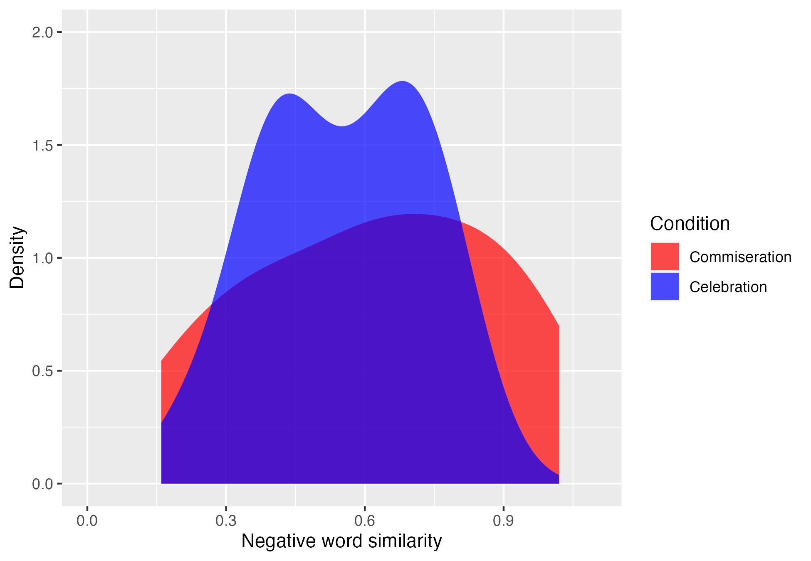

This document will be your very first reproducible manuscript. (Well, maybe.
Even if it's not your very first reproducible manuscript, I hope you find it
useful.) For this reproducible manuscript, we're going to be relying on the R
package called `papaja` [@R-papaja]. While you don't need to use it to create a
reproducible manuscript in R, it's designed specifically to create an
APA-formatted manuscript---which, if you're taking the 2020 UConn SLAC/NBL Data
Science Workshop, might be standard formatting for your academic journals of
choice.

Here, we're going to write up our formal report on
the toy experiment that we've been working with throughout the rest of this
tutorial.

```{r setup, include = FALSE}

# These chunks of code will not show up in your manuscript. However, it's still
# a great idea to practice good commenting in these chunks.

# clear the workspace
rm(list=ls())

# call in our required libraries
source('../rmarkdown/r_library_installation.r')
library(papaja)

```

```{r establish-caching, include = FALSE}

# If you have a lot of time-intensive processing and/or analyses, you'll find
# that caching is your friend. The one little line at the end of this chunk will
# handle this for you. By adding this line, you're telling R to make a new
# directory with `_cache` appended to the end of your file name. It will store
# your chunk output when you knit (or compile) the file. The next time you run
# the file, R will check to see if you've made any changes to the active code
# (not the text) since the last cache. If you haven't changed it, it'll load in
# your old results. If you have changed a chunk, it will re-run not only that
# chunk but all subsequent code.

# Pro tip: Caches aren't perfect. I'd recommend occasionally deleting the cache
# directory and recompiling. You should DEFINITELY delete it and recompile one
# last time when you're done with everything and ready to submit the manuscript.

# turn on caching
knitr::opts_chunk$set(cache=TRUE, autodep=TRUE, cache.lazy=FALSE)

```

```{r analysis-preferences}

# set seed for reproducible random number generation
set.seed(42)
knitr::opts_chunk$set(cache.extra = knitr::rand_seed)

```

```{r load-data}

# load in the dataset
experiment_df = read.table('../data/simulated_experiment_data.csv',
                           sep = ',',
                           header = TRUE)

# convert factor variables to factor
experiment_df = experiment_df %>% ungroup() %>%
  mutate(condition = as.factor(condition))

```

## The Present Study

The present study sought to investigate how conversational context and shared
affective language influence rapport-building between strangers. Patterns of
shared language have been shown to reflect a variety of individual and
interpersonal dynamics, including rapport [for review, see @duran2019align]. We
focused on conversation *goals* as our context---specifically, whether dyads
shared very positive things that happened to them in the past week or very
negative things that happened to them in the past week. For shared affective
language, we quantified the degree of similarity in partners' use of *positive
or negative emotion words* during the conversation. In doing so, we investigate
whether hallmarks of rapport are context-specific---that is, whether imaginary
people tend to feel closer to one another if they are more similar in
context-appropriate emotional dynamics.

# Method

## Participants

```{r participant-info}

# figure out what unique dyad IDs we have
unique_dyads = experiment_df %>% ungroup() %>%
  select(dyad_ID) %>%
  distinct()

```

We recruited `r dim(unique_dyads)[1]*2` individual imaginary volunteers to
participate as `r dim(unique_dyads)[1]` imaginary dyads of strangers. All
imaginary pairs were confirmed to be strangers during the experiment debriefing.
No participants or dyads were excluded from our sample for any reason.

At the time of running this imaginary experiment, no ethical body yet oversaw
the treatment of random number generators; therefore, no formal ethical approval
was obtained for the current imaginary study. However, we attempted to treat
these imaginary randomly generated volunteers with as much care as possible.

## Material and Procedure

```{r dyad-info}

# break down the data by condition
condition_dyads = experiment_df %>% ungroup() %>%
  group_by(condition) %>%
  dplyr::summarise(dyad_counts = n(), .groups="keep")

# get dyads in each conditions
commiseration_dyads = condition_dyads %>% ungroup() %>%
  filter(condition==0) %>%
  .$dyad_counts
celebration_dyads = condition_dyads %>% ungroup() %>%
  filter(condition==1) %>%
  .$dyad_counts

```


We asked our imaginary individual participants of imaginary strangers to hold
one of two kinds of conversations with one another: a *celebratory* conversation
(in which they are each asked to share and discuss a very positive thing that
happened to them in the last week) or a *commiseration* conversation (in which
they are asked to share and discuss a very negative thing that happened to them
in the last week).  Dyads were randomly assigned to condition upon arrival. By
chance, we had `r celebration_dyads` dyads assigned to the celebratory condition
and `r commiseration_dyads` dyads assigned to the commiseration condition. Each
dyad's conversation was video- and audio-recorded.

## Data Preparation and Analysis

### Rapport

To track quantify rapport, we recruited two expert observers in interpersonal
dynamics to serve as raters. We trained them to watch and listen to the recorded
interactions while continuously rating rapport using a joystick-style method
[cf. @sadler2009we], creating a time series of ratings between 0 and 1. We
obtained a single rapport rating by taking the mean of the time series.
Surprisingly, both raters demonstrated perfect agreement in their continuous
ratings of rapport ($M_{overall}$ = `r round(mean(experiment_df$rapport),2)`).

### Shared Language

```{r plot-positive-similarity-distribution, echo=FALSE, warning=FALSE, message=FALSE, error=FALSE, fig.cap="Positive word similarity by condition."}

# plot positive similarity scores by condition
positive_scores_by_condition = ggplot(data = experiment_df,
                                      aes(x = positive_word_similarity,
                                          fill = condition)) +
  geom_density(alpha=0.7, color=NA) +
  coord_cartesian(ylim=c(0, 2), xlim=c(0, 1.1)) +
  labs(x = 'Positive word similarity',
       y = 'Density',
       fill = 'Condition') +
  scale_fill_manual(values=c('red','blue'),
                     breaks = c(0, 1),
                     labels=c('Commiseration', 'Celebration'))

# save the file
ggsave("./figures/plot-positive_similarity_distribution.png")

# call the image


```

```{r plot-negative-similarity-distribution, echo=FALSE, warning=FALSE, message=FALSE, error=FALSE, fig.cap="Negative word similarity by condition."}

# plot negative similarity scores by condition
negative_scores_by_condition = ggplot(data = experiment_df,
                                      aes(x = negative_word_similarity,
                                          fill = condition)) +
  geom_density(alpha=0.7, color=NA) +
  coord_cartesian(ylim=c(0, 2), xlim=c(0, 1.1)) +
  labs(x = 'Negative word similarity',
       y = 'Density',
       fill = 'Condition') +
  scale_fill_manual(values=c('red','blue'),
                     breaks = c(0, 1),
                     labels=c('Commiseration', 'Celebration'))

# save the file
ggsave("./figures/plot-negative_similarity_distribution.png")

# call the image


```

Each dyad's conversation was transcribed verbatim. Positive and negative words
were identified using a simple bag-of-words approach (i.e., counting occurrences
of words identified as positive or negative). Metrics of shared positive
language and shared negative language were extracted by analyzing the
correlation of turn-to-turn counts of negative and positive words between
participants ($M_{negative}$ = 
`r round(mean(experiment_df$negative_word_similarity),2)`; 
$M_{positive}$ = `r round(mean(experiment_df$positive_word_similarity),2)`;
see Figs. \@ref(fig:plot-positive-similarity-distribution) and
\@ref(fig:plot-negative-similarity-distribution)).

##  Data Analysis

We analyzed our data with an ANOVA predicting rapport with condition (`0` =
commiseration condition; `1` = celebration condition), negative word similarity,
positive word similarity, and all interactions. We used 
`r cite_r("references.bib")` for all data preparation, visualizations, and
analyses[^1].

[^1]: The `cite_r()` function is a helper function from `papaja` [@R-papaja]
that will identify any references in the `.bib` file that begin with the prefix
`R-`. This is a helpful shortcut to ensuring that all of your software tools are
properly attributed in your manuscript.

# Results

(ref:table-main-model) Results from our statistical model

```{r ref:table-main-model}

# run our analysis
statistical_model = aov(rapport ~ negative_word_similarity * positive_word_similarity * condition,
                        data = experiment_df)

# get it ready to print in APA format
apa_anova = apa_print(statistical_model)

# set all of our specifications for printing---including landscape formatting!
apa_table(
  apa_anova$table
  , caption = "(ref:table-main-model)"
  , landscape = TRUE)

```

For clarity and flow, all analyses are reported in Table 1, but to demonstrate
how to programmatically call results, we will include significant *p*-values in
the text as well. Two main effects significantly predicted rapport: negative
word similarity (*p* = `r apa_anova$table$p[1]`) and condition
(*p* = `r apa_anova$table$p[3]`). The interaction between negative word
similarity and positive word similarity also significantly predicted rapport
(*p* `r apa_anova$table$p[4]`). No other main or interaction terms reached
statistical significance.

# Discussion

Here, we explored the effects of similarity of emotional language patterns
within specific emotion-inducing interaction contexts on perceived rapport
between stranger dyads. In so doing, we provided an opportunity to learn
how to create reproducible manuscripts with R markdown and `papaja`
[@R-papaja].

## Limitations and Future Directions

Of course, the present work is not without limitations, which we see as
opportunities for future studies. The most important limitation of the work
is our chosen population---that is, imaginary participants who contributed
simulated data. As such, we must conduct experiments with non-imaginary
participants in order to identify whether these observed effects hold in
non-simulated experimental contexts.

\newpage

# References

\begingroup
\setlength{\parindent}{-0.5in}
\setlength{\leftskip}{0.5in}

<div id="refs" custom-style="Bibliography"></div>
\endgroup
